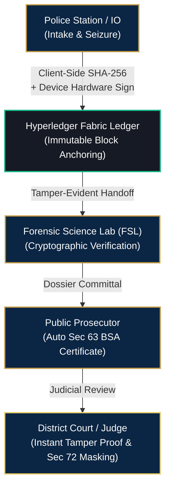

# NyayaVault (न्यायवॉल्ट) — Project Dharmic-Trust

> **Sovereign Cryptographic Evidence Vault & Chain of Custody Management System**  
> *Engineered for the Indian Criminal Justice System (ICJS / CCTNS / e-Courts Ecosystem)*  
> *Secure Digital Document Management System for Legal and Investigation Documents*

---


## 📌 Executive Summary

The Indian criminal justice pipeline—spanning over **14,000 police stations (CCTNS)**, **Forensic Science Laboratories (FSL)**, **Directorates of Prosecution**, and **District/High Courts (e-Courts)**—faces systemic challenges around evidentiary provenance, custody gaps, and statutory privacy non-compliance:

* **Evidentiary Integrity Challenges:** Defense lawyers frequently challenge FIRs and seizure memos as "antedated" or substituted during transit between police stations and courts.
* **Section 63 BSA Delays:** Compliance with **Section 63 of Bharatiya Sakshya Adhiniyam, 2023 (BSA)** (formerly Section 65B of the Indian Evidence Act, 1872) requires tedious technical affidavits, causing endless adjournments.
* **Section 72 BNS Privacy Leaks:** Manual "black-marker" redaction of sexual assault and POCSO victims under **Section 72 of Bharatiya Nyaya Sanhita, 2023 (BNS)** (formerly Section 228A IPC) routinely fails, leaking identities in charge sheets and court rosters.
* **Rural & Remote Outpost Disconnect:** Rural police stations with unstable internet cannot rely on cloud-only DMS tools without facing allegations of suspicious delay.

**NyayaVault** bridges this divide. It provides a sovereign, tamper-evident digital evidence ecosystem anchored to a permissioned **Hyperledger Fabric** blockchain ledger, real-time client-side cryptographic hashing, automated Section 63 BSA certificate generation, and an automated Section 72 BNS AI redaction engine.

---

## 🏛️ Core Statutory Pillars & Key Innovations



### 1. Section 63 BSA Automated Admissibility Engine
* Generates mathematically verifiable, one-click electronic evidence certificates.
* Automatically records:
  - Cryptographic SHA-256 digest
  - Device hardware signature & MAC fingerprint
  - Synchronized server timestamp (NTP-locked)
  - Full cryptographic custody trajectory across agencies.

### 2. Section 72 BNS AI Privacy Redaction Studio
* Integrated directly into the evidence upload workflow.
* Employs legal NLP (InLegalBERT) to automatically identify and mask sensitive personal identifiable information (PII):
  - Victim & witness names
  - Minor / POCSO identifiers
  - Residential addresses & phone numbers
  - Medical details & vulnerable entity data.
* Enforces role-based unmasking with strict dual-hash binding (master hash vs. redacted hash).

### 3. Sovereign Hyperledger Fabric Consortium
* Permissioned, zero-gas architecture operated strictly by authorized state actors (Police, FSL, Judiciary).
* Stores lightweight metadata, hashes, state transitions, and audit records on-chain (files remain encrypted in local/hybrid object storage).

### 4. Client-Side Cryptographic Ingestion
* Generates real SHA-256 checksums in-browser using the W3C Web Crypto API prior to network transmission, proving the document byte sequence has not altered by even a single bit.

### 5. Offline-First Resilience
* Built-in field mode simulation allows rural officers to scan, locally hash, sign, and queue records offline, reconciling timestamps seamlessly upon network reconnection.

---

## 👥 Role-Based Access Control (RBAC)

NyayaVault features four specialized judicial personas with prototype 1-click auto-fill access:

| Role | Username | Default Password | Jurisdictional Duty |
| :--- | :--- | :--- | :--- |
| **Investigating Officer (IO)** | `io_officer.nyayavault` | `password123` | First information recording, evidence ingestion, seizure memos, field hash anchoring, and offline sync. |
| **Forensic Lab Analyst** | `forensic_analyst.nyayavault` | `password123` | Seized electronic evidence inspection, cryptographic hash verification, and forensic report uploads. |
| **Public Prosecutor** | `prosecutor.nyayavault` | `password123` | Police dossier scrutiny, Section 72 BNS compliance inspection, and Section 63 BSA certificate export. |
| **District & Sessions Judge** | `judge.nyayavault` | `password123` | Sealed record inspection, blockchain tamper-evidence validation, and digital order signing. |

---

## 🗂️ Unified Sidebar Architecture

All four authenticated role dashboards share a standardized 7-item navigation sidebar:

1. **Dashboard:** Role-tailored metrics, active caseloads, priority alerts, and recent documents.
2. **Case Dossiers:** Searchable case repository with jurisdiction filters and filing timelines.
3. **Documents:** Master evidence library with file-type tags and verification states.
4. **Upload Evidence *(Highlighted)*:** 5-step evidence ingestion pipeline with SHA-256 generation and integrated AI redaction.
5. **Chain of Custody:** Immutable, chronological block-by-block custody audit ledger.
6. **Offline Sync:** Mobile field sync simulator and offline queue manager.
7. **System Settings:** Consortium channel status, peer node identity, and node telemetry.

---

## 🛠️ Technology Stack

| Layer | Technology | Description |
| :--- | :--- | :--- |
| **Frontend Framework** | React 18 (`^18.3.1`) | Component-driven declarative UI. |
| **Build Tooling** | Vite (`^6.2.0`) | Lightning-fast HMR and optimized production bundling. |
| **Design System** | Custom Vanilla CSS | Tailored Indian Judicial palette (`#0A0D14`, `#0B2545`, `#C59A45`), glassmorphic panels, and high-contrast typography. |
| **Icons** | Lucide React (`^1.16.0`) | Lightweight, consistent judicial and security iconography. |
| **Visual Effects** | Canvas Confetti (`^1.9.4`) | Interactive verification feedback. |
| **Cryptography** | W3C Web Crypto API | In-browser hardware-accelerated SHA-256 calculation. |
| **Consortium Ledger** | Hyperledger Fabric v2.5 (Simulated) | Channel: `police-court-consortium`, Peer: `peer0.org1.cgpolice.gov.in`. |

---

## 🚀 Getting Started

### Prerequisites
* **Node.js** (v18.0.0 or higher)
* **npm** (v9.0.0 or higher)

### Installation

1. **Clone or navigate to the project directory:**
   ```bash
   cd NyayaVault
   ```

2. **Install project dependencies:**
   ```bash
   npm install
   ```

3. **Start the local development server:**
   ```bash
   npm run dev
   ```
   The application will be accessible at: `http://localhost:5173/`

4. **Build for production:**
   ```bash
   npm run build
   ```

5. **Preview production bundle locally:**
   ```bash
   npm run preview
   ```

---

## 🛡️ Authentication & Navigation Route Protection

NyayaVault implements an authentication-aware navigation architecture:

* **Unauthenticated Navigation:** Browser Back between `/login` and `/landing` works naturally without restrictions.
* **Authenticated Route Guard:** Upon login, the login history entry is replaced with `/dashboard`. Authenticated users cannot escape to the public landing or login page via browser Back (preventing session escape and history loops).
* **Direct Access Guards:**
  - Authenticated users attempting to access `/login` or `/landing` are automatically redirected to their role dashboard.
  - Unauthenticated users attempting to access `/dashboard` or protected routes are automatically redirected to `/login`.
* **Session Persistence:** Active authentication, role context, and opened case/document selections survive full page refreshes via `sessionStorage`.
* **Explicit Logout:** Logging out clears the authentication tokens and returns the user to the public portal with clean history.

---

## 📁 Repository Structure

```text
NyayaVault/
├── public/
│   ├── hero-casefile.jpg          # Cinematic landing hero background
│   ├── login-bg.jpg               # Courtroom ambient background
│   └── login-emblem.jpg           # Ashoka Lion Capital vertical artwork
├── src/
│   ├── components/
│   │   ├── AshokaLogo.jsx         # Official State Emblem branding component
│   │   ├── Sidebar.jsx            # Unified 7-item role navigation sidebar
│   │   ├── StateEmblemOfIndia.jsx # Scalable SVG Ashoka Lion Capital
│   │   └── TopNav.jsx             # Top bar with session greeting & network controls
│   ├── data/
│   │   ├── mockData.js            # Initial cases, documents, and sensitive PII entities
│   │   └── rolesData.js           # RBAC single source of truth (IO, FSL, Prosecutor, Judge)
│   ├── styles/
│   │   ├── auth.css               # Dual-panel login & MFA styles
│   │   └── landing.css            # Cinematic 100vh landing page styles
│   ├── views/
│   │   ├── AuditTrailPage.jsx         # Consortium ledger audit logs
│   │   ├── BsaCertificatePage.jsx     # Section 63 BSA certificate generator
│   │   ├── CaseDetailsPage.jsx        # Deep case inspection with evidence listing
│   │   ├── CaseManagementPage.jsx     # Master case dossiers
│   │   ├── ChainOfCustodyPage.jsx     # Visual blockchain block timeline
│   │   ├── DashboardPage.jsx          # Role-tailored operational overview
│   │   ├── DocumentIngestionPage.jsx  # 5-step upload & AI redaction pipeline
│   │   ├── DocumentViewerPage.jsx     # Dual-pane secure document inspection
│   │   ├── LandingPage.jsx            # Public portal and citizen verifier
│   │   ├── LoginPage.jsx              # RBAC login modal with 1-click accounts
│   │   ├── MfaPage.jsx                # Two-factor authentication simulator
│   │   ├── MobileAppSimulatorPage.jsx # Offline field mode & queue simulator
│   │   ├── RoleSelectPage.jsx         # Federated identity role picker
│   │   └── VerificationPortalPage.jsx # Public SHA-256 drag-and-drop hash verifier
│   ├── App.jsx                    # Root routing engine, popstate guards, & session management
│   ├── index.css                  # Design tokens, variables, & global reset
│   └── main.jsx                   # React DOM entry point
├── .gitignore
├── index.html
├── package.json
└── vite.config.js
```

---

## ⚖️ Legal & Regulatory Alignment

* **Bharatiya Sakshya Adhiniyam, 2023 (BSA):** Enforces Section 63 electronic records admissibility requirements.
* **Bharatiya Nyaya Sanhita, 2023 (BNS):** Strict algorithmic enforcement of Section 72 identity non-disclosure.
* **Information Technology Act, 2000:** Protected system compliance under Section 43A and Section 70.
* **Indian e-Governance Standards (GIGW 3.0) & WCAG 2.1 AA:** Accessible contrast ratios, semantic hierarchy, and keyboard navigability.

---

## 📄 License & Attribution

Developed as an innovative prototype solution for secure legal and investigation document management within the Indian Criminal Justice System.  
*All national insignia, emblems, and statutory references are utilized strictly for mock demonstration and prototype evaluation purposes.*
